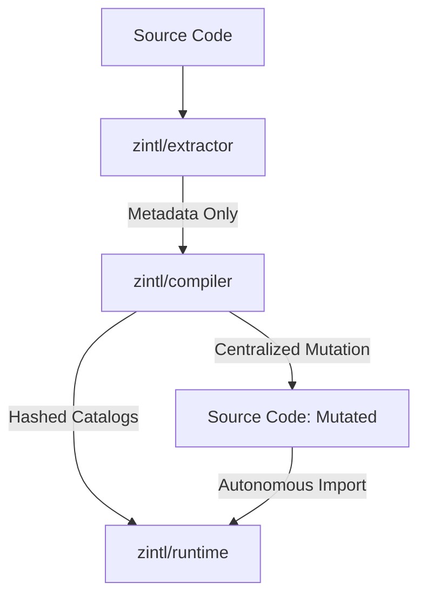
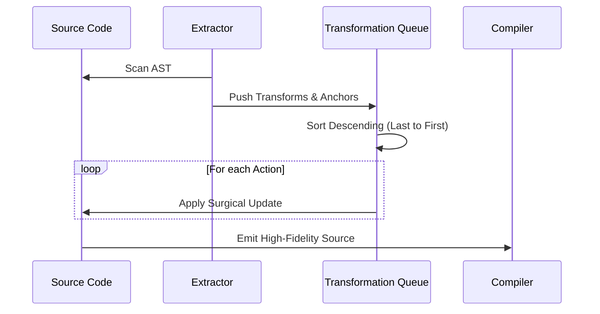
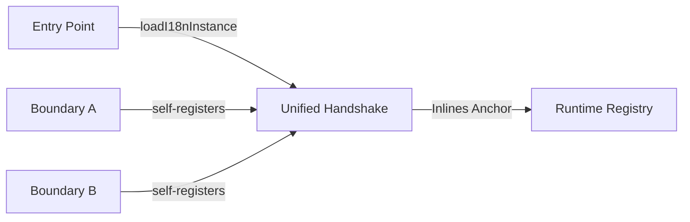

# Zintl: The Compiler-Driven Internationalization Engine

Zintl is a precision-engineered i18n system for modern web applications. It moves internationalization from a runtime helper to a compile-time concern, delivering zero-config extraction, zero-runtime overhead, and character-perfect source mutation.

---

## 1. The Zintl Identity Crux

Zintl is governed by the philosophy of **Logical Surgery**. We do not accept "maybe it works." The system is built on precision, deterministic behavior, and the **Bakalau** spirit—measurable architecture and non-destructive sharpening.

### Core Pillars:

- **Zero-Config Extraction**: Automatic detection of UI sinks (JSX, innerHTML, Object Fields) without manual tagging.

* **Character-Perfect Mutation**: Centralized transformation pipeline using descending-index surgery to eliminate collision debt.

- **Decentralized Registry**: Every file functions as an autonomous, self-registering boundary via a unified Handshake model.

* **Steady-State Identity**: Content-based boundary hashing (`b_<hash>`) ensures stability across renames and refactors.

---

## 2. Core Architecture: The Three-Body Model

Zintl is partitioned into three specialized packages, isolating extraction, transformation, and resolution.

### @zintljs/extractor (The Pure Provider)

Functions as a pure metadata provider. It scans the AST for anchor sites (`zintl()`) and UI-sinks, returning precise `transforms` and `messages` metadata without modifying the source.

### @zintljs/compiler (The Mutation Dictator)

The sole authority for source modification. It consumes extractor metadata, orchestrates a centralized transformation queue, and generates chunk-aware catalogs.

### @zintl/runtime (The Registry Driver)

A minimalist, registry-driven runtime that handles the low-latency handshake between translated UI and the decentralized catalog registry.

---

## 3. The Salvation Transformation Pipeline

At the heart of the compiler is the **Salvation Pipeline**, designed to resolve systemic transformation debt.

### Centralized Queue Logic

All mutation actions (Manager injection, `t()` call rewrites, Macro baking) are collected into a single, unified queue. This queue is sorted by index in **descending order**, ensuring that each surgical edit does not invalidate the offsets of subsequent actions.

---

## 4. Decentralized Registry (The Autonomous Handshake)

Zintl resolves "Island Interleaving" and initialization races through a decentralized registry model.

### Every File is a Boundary

Every file with extractable content self-registers its own `Smart Manager` via a virtual module handshake. This ensures that no matter how deep an "island" is imported, its translations are guaranteed to be registered BEFORE use.

### Virtual Module Schema:

- `virtual:zintl/manager/[locale]/entry:[boundaryId]`

### The Handshake Model:

1. **Import**: The module imports its own `_zintl_mgr`.
2. **Handshake**: The `loadI18nInstance` call at the entry point registers all reachable manager loaders.
3. **Pre-Registry**: In production, the compiler "bakes" translations directly or injects the manager for low-latency lazy loading.

---

## 5. Steady-State Identity (Deterministic Hashing)

Boundaries identify themselves using stable, content-based hashes (**Refactor Amnesia** protection).

- **Algorithm**: `b_` + `sha1(boundaryId)`.
- **Logic**: The `boundaryId` includes the relative file path and, for nested anchors, the function scope (e.g., `src/main:render`).
- **Benefit**: 100% build stability in async environments (Vite).

---

## 6. High-Fidelity Macro Baking

In production builds, Zintl aggressively reduces runtime overhead through **Macro Baking**.

- **Literal Inlining**: If the anchor locale is active, `t("key")` calls are replaced with `Translated String` literals at build time.
- **Zero-Runtime Fallback**: If a message is missing, it is baked as an empty string `""`, preventing runtime `null` leakage.

---

## 7. Configuration & Constraints

### Directive System:

- `@zintl-ignore`: Suppresses extraction for a node and children.
- `@zintl-note`: Provides persistent context for translators.
- `@zintl-pass`: Injects context variables (e.g., gender, role) via the registry.

### Character-Perfect Guarantees:

- **No Nulls**: Fallbacks are always strings.
- **Sorted Imports**: Manager imports are always prepended before the first `t()` usage.
- **Collision-Free Logic**: Universal `_zintl_mgr` prefix prevent variable shadowing in nightmare scenarios.

---

**Mantra**: _Measure the shame, sharpen the architecture, bakalau!_
